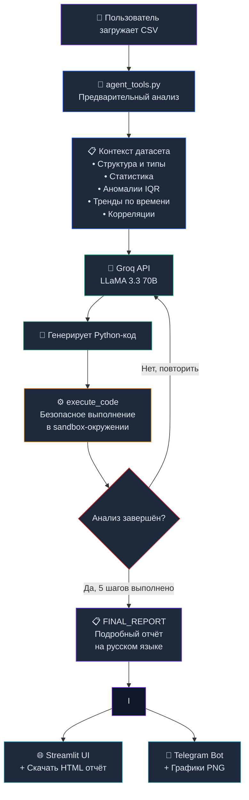

# 🛸 Data Analyst Agent

> ИИ-агент для автоматического анализа данных с веб-интерфейсом и Telegram-ботом


---

## 📌 О проекте

**Data Analyst Agent** — это полноценный ИИ-агент для анализа данных, который:

- Принимает **любой CSV-файл** от пользователя
- Самостоятельно **пишет и выполняет Python-код** для анализа (ReAct-агент)
- Строит **графики и визуализации** автоматически
- Формирует **подробный отчёт** на русском языке с выводами и рекомендациями
- Позволяет **скачать отчёт** в виде красивого HTML-файла
- Доступен через **веб-интерфейс** (Streamlit) и **Telegram-бот**

### Ключевое отличие от простых решений

Агент не просто пересказывает статистику из промпта — он **сам пишет код**, **запускает его**, **видит результат** и делает выводы на основе реального выполнения. Это полноценный ReAct-цикл:
Думает → Пишет код → Выполняет → Видит результат → Делает вывод → Повторяет
---

## 🏗️ Архитектура
data-analyst-agent/
├── app.py              # Веб-интерфейс (Streamlit)
├── bot.py              # Telegram-бот
├── agent_tools.py      # Инструменты агента (анализ + визуализация)
├── report_builder.py   # Генератор HTML-отчётов
├── ufo_sightings.csv   # Тестовый датасет (NUFORC UFO Sightings)
└── README.md
### Схема работы агента


## 🛠️ Стек технологий

| Компонент | Технология |
|-----------|-----------|
| LLM | LLaMA 3.3 70B via Groq API |
| Веб-интерфейс | Streamlit |
| Telegram-бот | pyTelegramBotAPI |
| Анализ данных | pandas, numpy |
| Визуализация | matplotlib, seaborn |
| Отчёты | HTML (кастомный генератор) |
| Безопасность | Prompt injection защита, sandbox выполнение кода |

---

## ⚙️ Установка

### 1. Клонируй репозиторий

```bash
git clone https://github.com/твой_ник/data-analyst-agent.git
cd data-analyst-agent
```

### 2. Установи зависимости

```bash
pip install streamlit groq pandas numpy matplotlib seaborn pytelegrambotapi
```

### 3. Получи API ключи

**Groq API (бесплатно):**
1. Зайди на [console.groq.com](https://console.groq.com)
2. Войди через Google
3. API Keys → Create API Key
4. Скопируй ключ (начинается с `gsk_...`)

**Telegram Bot Token:**
1. Найди [@BotFather](https://t.me/BotFather) в Telegram
2. Напиши `/newbot`
3. Следуй инструкциям
4. Скопируй токен

### 4. Вставь ключи в файлы

В `app.py` и `bot.py` замени:
```python
API_KEY   = "твой_groq_api_ключ"
BOT_TOKEN = "твой_telegram_токен"  # только в bot.py
```

---

## 🚀 Запуск

### Веб-интерфейс (Streamlit)

```bash
streamlit run app.py
```

Открой браузер: **http://localhost:8501**

### Telegram-бот

```bash
python bot.py
```

Найди бота: **[@data_analyst_ufo_bot](https://t.me/data_analyst_ufo_bot)**

---

## 📖 Как пользоваться

### Веб-интерфейс

1. Загрузи CSV-файл через кнопку **Upload**
2. Напиши инструкцию (опционально):
   - *"Обрати внимание на сезонность"*
   - *"Найди аномалии в ценах"*
   - *"Сделай акцент на географии"*
3. Нажми **🚀 Запустить анализ**
4. Наблюдай как агент работает шаг за шагом
5. Скачай готовый **HTML-отчёт**

### Telegram-бот

| Команда | Описание |
|---------|----------|
| `/start` | Начать работу |
| `/help` | Справка |
| `/example` | Пример датасета |
| `/analyze` | Запустить стандартный анализ |
| Отправить CSV | Загрузить датасет |
| Написать текст | Задать инструкцию для анализа |

---

## 📊 Что анализирует агент

### 5 шагов анализа

| Шаг | Задача |
|-----|--------|
| 1 | Структура данных: типы, пропуски, дубликаты, качество |
| 2 | Описательная статистика: квантили, распределения, топ значения |
| 3 | Тренды и закономерности: временная динамика, географические паттерны |
| 4 | Аномалии и выбросы: IQR-метод, экстремальные значения |
| 5 | Финальный отчёт: выводы, рекомендации, бизнес-инсайты |

### Автоматические графики (agent_tools.py)

- 📊 Гистограммы + boxplot числовых переменных
- 📋 Топ категорий по столбцам
- 📈 Тренд по годам с аннотацией пика
- 🗓️ Сезонность по месяцам
- 🌡️ Тепловая карта корреляций
- ❌ Визуализация пропущенных значений

---

## 🛡️ Безопасность

### Защита от Prompt Injection

Приложение проверяет пользовательский ввод на паттерны атак:

```python
INJECTION_PATTERNS = [
    r"ignore\s+(all\s+)?previous\s+instructions",
    r"forget\s+(all\s+)?previous",
    r"jailbreak",
    r"dan\s+mode",
    # и другие...
]
```

### Изолированное выполнение кода

Код агента выполняется в sandbox-окружении с ограниченным доступом:

```python
safe_globals = {
    "pd": pd, "plt": plt, "sns": sns,
    "df": df.copy(),  # копия датасета
    "__builtins__": {},  # без встроенных функций Python
    # только безопасные функции...
}
```

### Блокировка опасных операций

```python
DANGEROUS_CODE = [
    "subprocess", "os.system", "os.popen",
    "socket", "requests", "urllib",
    "open(", "__import__",
    # и другие...
]
```

---

## 💡 Примеры датасетов для тестирования

| Датасет | Описание | Ссылка |
|---------|----------|--------|
| 🛸 UFO Sightings | 80к наблюдений НЛО (1906-2014) | [TidyTuesday](https://raw.githubusercontent.com/rfordatascience/tidytuesday/main/data/2019/2019-06-25/ufo_sightings.csv) |
| 🚢 Titanic | Выживаемость пассажиров | [Kaggle](https://www.kaggle.com/c/titanic) |
| 🌸 Iris | Классификация цветов | [UCI ML](https://archive.ics.uci.edu/ml/datasets/iris) |

---

## 📸 Скриншоты


> Загрузка файла и инструкция для агента

### Веб-интерфейс — работа агента


> Пошаговое выполнение анализа с раскрывающимися блоками

### Веб-интерфейс — результаты


> Графики, финальный отчёт, кнопка скачивания HTML

### Telegram-бот


> Загрузка CSV → анализ → отчёт и графики в чате

---

## 🗃️ Тестовый датасет

**UFO Sightings — NUFORC** (National UFO Reporting Center)

- **Строк:** 80 332
- **Столбцов:** 11
- **Период:** 1906 — 2014
- **Источник:** [TidyTuesday 2019-06-25](https://github.com/rfordatascience/tidytuesday/tree/main/data/2019/2019-06-25)

| Столбец | Описание |
|---------|----------|
| `date_time` | Дата и время наблюдения |
| `city_area` | Город/район |
| `state` | Штат (для США) |
| `country` | Страна |
| `ufo_shape` | Форма объекта |
| `encounter_length` | Длительность (секунды) |
| `description` | Описание очевидца |
| `latitude` / `longitude` | Координаты |

---

## 📝 Связь с другими заданиями

Этот проект является частью серии заданий по аналитике данных:

- **Задание 1** — Промпт-инженерия: анализ UFO датасета через 4 промпта
- **Задание 2** — API-пайплайн: автоматическая классификация описаний НЛО → JSON
- **Задание 3** — Этот проект: полноценный ИИ-агент с интерфейсом

Все три задания используют один датасет UFO Sightings (NUFORC), что создаёт сквозную аналитическую историю от простых промптов до полноценного продукта.

---

## 👨‍💻 Автор

Выполнено в рамках курса **"Аналитика данных"**
